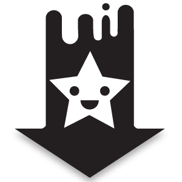
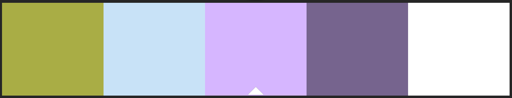
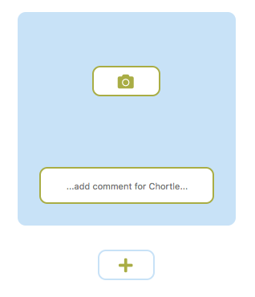
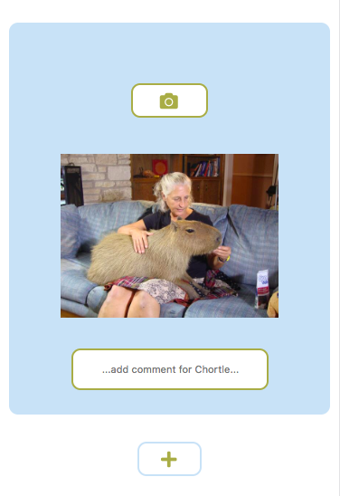
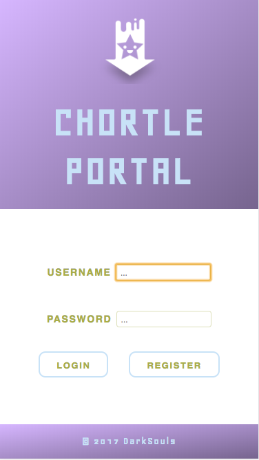
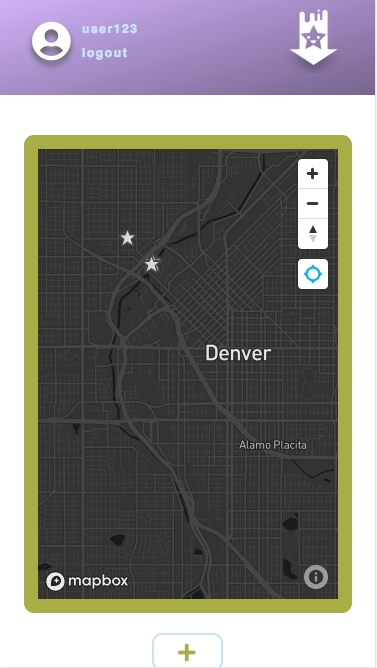
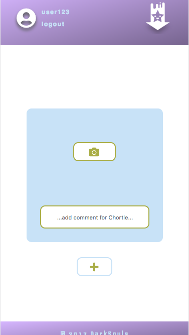
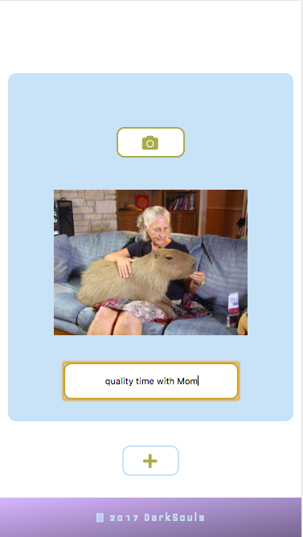
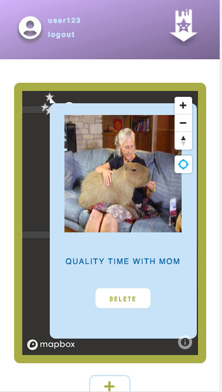

<h1 align="center">
  </img>
  <br>  
  CHORTLE PORTAL
</h1>

## About
Chortle Portal is a light-hearted, social application that connects Users to each other and their surroundings. Unlike other social apps, Chortle Portal physically connects Users to the world outside of their phones. Instead of having to check in at an established location, Users can use Chortle Portal where ever they like. From street art to a comical pedestrian, users can take pictures, add comments and drop the content to that specific location on the map to be viewed by friends at a later time.

## Created By

[Connor Alcock](https://github.com/connoralcock87)<br>
[Roxanne Baldwin](https://github.com/RoxMBaldwin)<br>
[Logan Crewss](https://github.com/lcrewss)<br>
[Michael Harrington](https://github.com/mike85h)<br>
[Dan Mickulesku](https://github.com/DMickulesku)

*special thanks to Berto and Matt for all their help*

## Updated UX/UI
As a developer who is specifically interested in UX/UI development and design choices, I decided to re-evaluate and update Chortle Portal's interface to improve usabilty and the overall user-flow of the app.

#### I. Graphic Design:
**a) logo**

 to 
- *chortles* are represented by a star icon on the map, incorporate that visual into the logo for consistency

**b) color**


- lighter background to contrast with the darker map
- adjusted tone of color palette; used to indicate grouping of elements (buttons, form, etc)

**c) typography**
- main font: changed to stay consistent with angles of new logo
- secondary font: used within the applications body for a clean UX

#### II. UX/UI:
The simplicity of the orginial layout was retained; however, some UI changes were added to make the app more engaging and efficent for the user

**a) removed Astronaut GIF from new Chortle component:**

- Orginally used to create a sense of exploration through the movement of the astronaut; considered now to be distracting

**b) file input hidden on top of stylized button**
<h1 align="center">

</h1>

- When I was researching how to style and customize the file input, I found that it is near impossible to directly manipulate the format of: <input type="file">.
  - I added a button, styled to be uniform with the application's other buttons, and gave it a CSS z-index atrribute less than the ```<input type="file">``` and disabled the button.
  - I made the ```<input type="file">``` transparent so although the user was actually clicking on the correct input to choose a file, the user's experience was uninterrupted and the interface consistent.

**c) preview of image once file selected**
<h1 align="center">

</h1>

- A consistent feature in social apps is to have the selected image shown once selected
  - Instead of adding a large library just to have access to a preview option, I simply added a function to handle the event saving time and memory.

**d) refactored previous CSS to SCSS**
- The nesting and variable features offered by Sass are valuable and make it more efficent to read and write CSS.

## Deployed URLs
[Updated Deployed URL with UX/UI changes made by Roxanne:](https://welcome-to-chortle-portal.firebaseapp.com/)

[Server Deployed URL: Heroku](https://salty-mountain-21631.herokuapp.com/)
<hr>
[Group Deployed URL: Firebase](https://chortle-portal.firebaseapp.com/main.html)

[Server Deployed URL: Heroku](https://salty-mountain-21631.herokuapp.com/)

## Repositories
[Roxanne: Updated UX/UI](https://github.com/RoxMBaldwin/ChortlePortal-client)

[Server Side Repository](https://github.com/DarkSoulsMongo/ChortlePortal-server)

<hr>
[Team: Dark Souls](https://github.com/DarkSoulsMongo)

[Server Side Repository](https://github.com/DarkSoulsMongo/ChortlePortal-server)

 -  *to install all server dependancies:*
```
npm install
```

## Technologies Used
<h1>


</h1>
<h1>


</h1>

## Presentation

[Presentation Slides](https://prezi.com/d-5dlokhfmvb/chortle-portal/)

[Youtube Demonstration Video](https://www.youtube.com/watch?v=Yn5Do6cTrAI&feature=youtu.be)

**will add updated UX/UI presentation**

## Wireframes

**Landing Page:**


**Main App:**


**Post Chortle:**


## Story Tracker
[User Stories on Pivotal Tracker](https://www.pivotaltracker.com/n/projects/2110435#)

## Updated UX/UI: Mobile Viewport | iPhone 6
**Login:**



**Map:**



**Form:**




**POST Success:**



## Group: Mobile Viewport | iPhone 6
**Login:**


**Map:**


**Form:**


**POST Success:**


## Future Implementations
a) Add OAuth

b) A/B Testing between original project and updated UX/UI  and Voice of Customer (VOC) survey to gather user data

c) Push functionality of application

d) Refactor to be mobile specific

e) Compile user data into visual constructs, such as graphs, to support *why* design decisions were made
- *'user data showed "X" so "Y" changes were made'*
